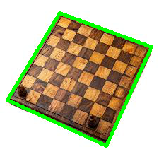

# Detector de tableros de ajedrez

Herramienta de visión por computador que detecta automáticamente un tablero de ajedrez en una fotografía y dibuja su contorno sobre la imagen.

Construido con Python y OpenCV como primer proyecto de una serie sobre procesamiento de imágenes.

## Resultado



El programa recibe una foto y devuelve la misma imagen con el cuadrilátero del tablero trazado a partir de sus cuatro esquinas.

## Cómo funciona

El programa procesa la imagen en una secuencia de etapas, donde cada una prepara la entrada de la siguiente:

**1. Escala de grises.** Una imagen a color tiene tres canales (azul, verde, rojo). La detección de bordes necesita una sola intensidad por pixel para medir los cambios bruscos, así que primero se colapsan los tres canales a uno solo (0–255).

**2. Suavizado (Gaussian blur).** Se difumina la imagen para eliminar los saltos de intensidad pequeños (la veta de la madera, las casillas internas) y conservar solo los grandes (el borde exterior del tablero). Sin este paso, la detección de bordes marcaría también la textura interna como si fuera contorno.

**3. Detección de bordes (Canny).** Se identifican los cambios bruscos de intensidad que sobrevivieron al suavizado, dejando el contorno del tablero como líneas sobre fondo negro.

**4. Búsqueda de contornos.** Se extraen las curvas cerradas de la imagen de bordes. Se ignoran los contornos internos (`RETR_EXTERNAL`) y, asumiendo que el tablero es el objeto dominante de la foto, se selecciona el de mayor área.

**5. Aproximación a polígono.** El contorno seleccionado se reduce a sus vértices esenciales. Si la detección fue limpia, devuelve los cuatro puntos de las esquinas del tablero, que se dibujan sobre la imagen original.

## Uso

```bash
python tablero.py
```

La imagen a analizar se define dentro del script (`tableroejemplo.jpeg`).

## Dependencias

```bash
pip install opencv-python
```

## Limitaciones

El método asume una foto con el tablero como objeto dominante, buena iluminación y fondo despejado. Los parámetros (tamaño del kernel del blur, umbrales de Canny) están calibrados para este tipo de imagen y pueden requerir ajuste con fotos muy distintas. La detección tampoco corrige la perspectiva: en tableros fotografiados en ángulo, el cuadrilátero sigue la inclinación real de la imagen.

## Próximos pasos

- Normalizar el tamaño de entrada para estabilizar la calibración entre fotos distintas.
- Corrección de perspectiva (homografía) para enderezar tableros fotografiados en ángulo.
